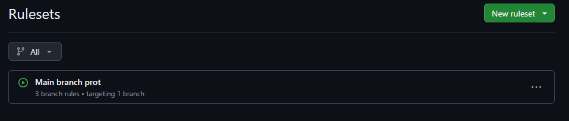
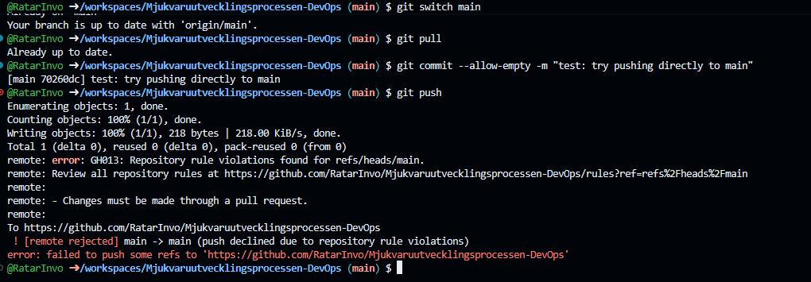
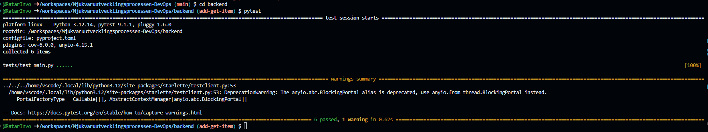
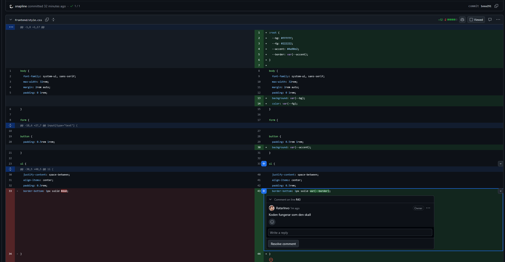
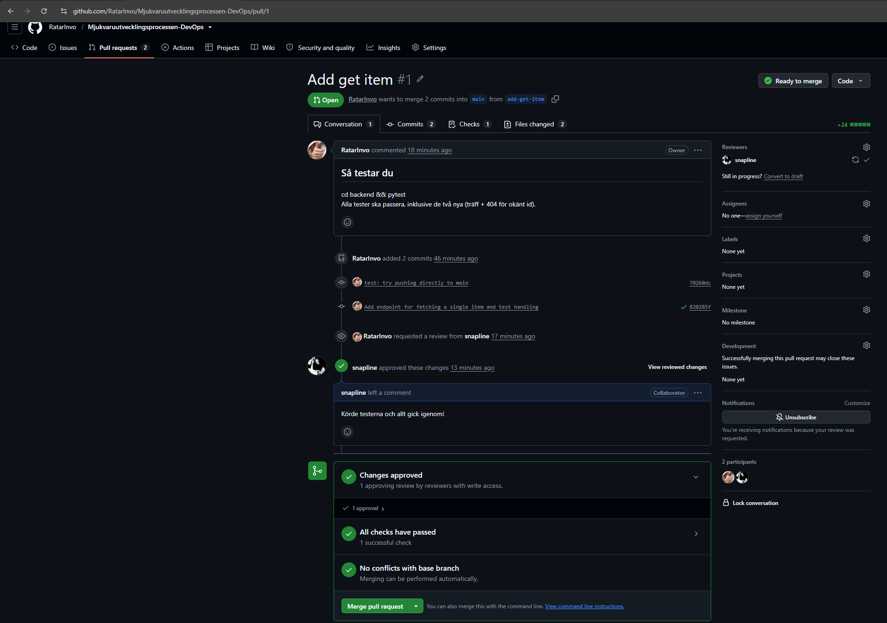
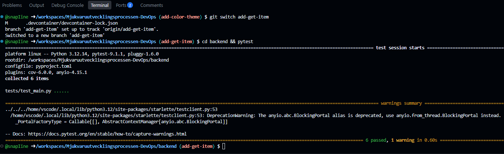
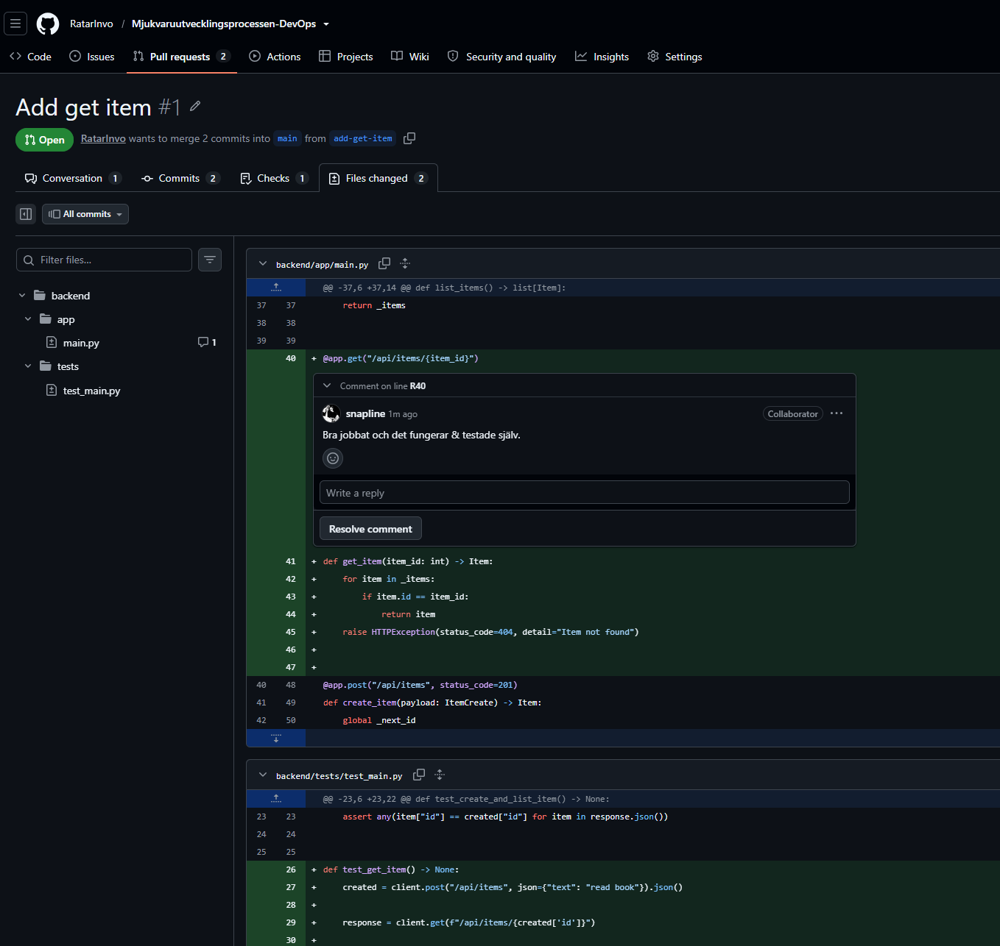
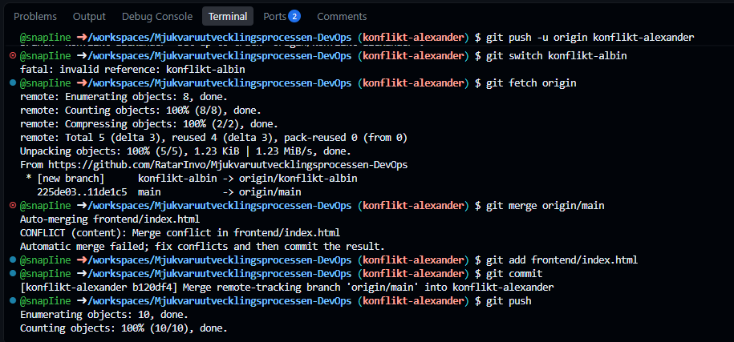

## Vad vi gjorde utanför repot
Den här labben handlade om att sätta upp branch protection i ett GitHub-repo så att alla ändringar till `main` måste göras via pull requests med godkänd review. Vi skapade två övningsuppdrag (backend-ändring och frontend-stilmall), gjorde PR, granskar och mergar. Sedan simulerar vi en merge-konflikt genom att båda ändrar samma rad på olika brancher, och lärde oss lösa den i terminalen. Slutligen taggades milstolpen med `m2-review` och allt dokumenteras med skärmdumpar och text.

## Skärmdump

*Lägg bildfilen i samma mapp (`inlamning/`) och committa den tillsammans
med texten — `.gitignore` tillåter bilder.*

## Format
- 3–5 meningar: vad ni gjorde, var (vilket verktyg/konsol) och hur ni
  verifierade att det fungerade.
- Minst en skärmdump eller ett terminalutdrag när milstolpen har arbete
  utanför repot.
- Filnamn: `mN-<kort-namn>.<valfri ändelse>` (samma nummer som
  milstolpens tagg) — `.md` här är bara ett exempel, `.txt`, Word eller
  vad ni är bekväma med går lika bra.
