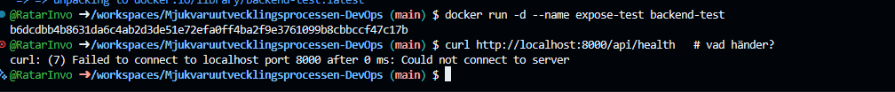
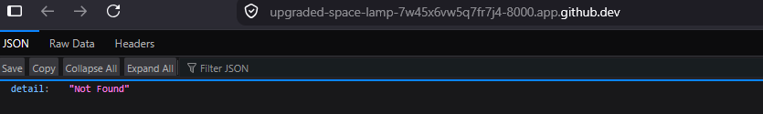
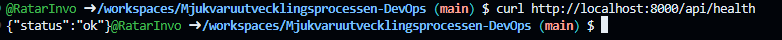
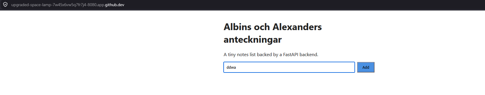
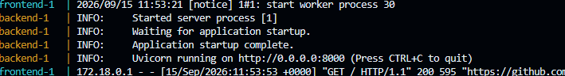
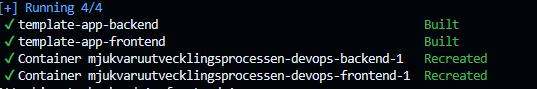
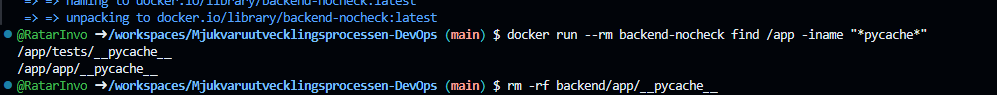
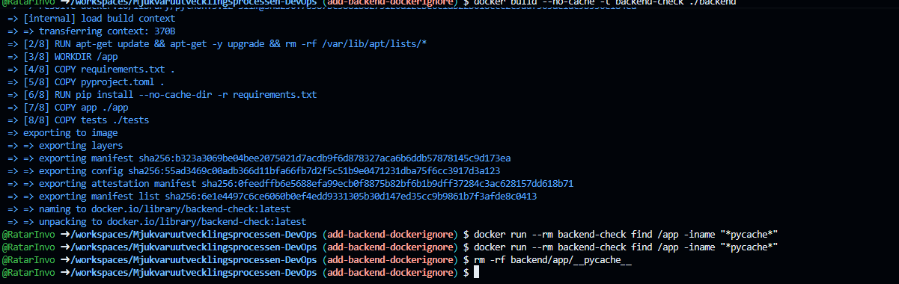
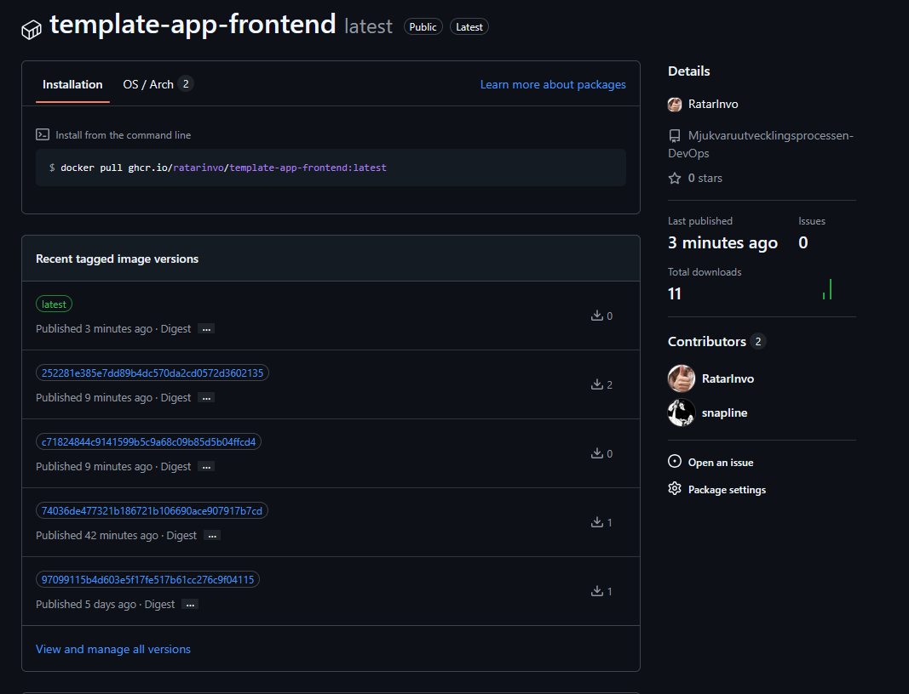

## Vilken rad avgör Python-versionen imagen bygger på?
### första raden "FROM python:3.12-slim" på grund av att installer den där.
## COPY requirements.txt . och RUN pip install ... kommer FÖRE COPY app ./app. Varför i den ordningen, och inte tvärtom? (Ledtråd: föreläsningens cache-slide.)
### På grund av att RUN pip install skulle runna varje gång du gör kod skillnader
## EXPOSE 8000 — tror ni den raden gör porten nåbar utanför containern, så att curl i er terminal når den? Testa gissningen i nästa deluppgift.
### Tror så

## Varför finns ingen RUN-rad här, till skillnad från backend?
### Svar: För att vi vill köra RUN i backend och inte på frontend.

## Varför inget eget CMD? (Basimagen nginxinc/nginx-unprivileged:alpine har redan ett.)
### Svar: För att basimagen redan tillhandahåller exakt det CMD som behövs.

## nginx.conf kopieras in som webbserverns konfiguration — öppna filen, hitta raden som pratar med backend:8000. Var kommer namnet backend ifrån? (Svar i steg 3 — det är inget magiskt, det är compose-filens tjänstenamn.)
### Svar: Name must stay "backend" — frontend/nginx.conf proxies /api/ to http://backend:8000/, same as the backend service name in docker-compose.yml. Backend har sitt namn för det beskriver saker som händer i backgrunden som man inte normalt ser.

## Varför nginx-unprivileged och inte vanliga nginx? Standard-imagen kör som root inuti containern och lyssnar på port 80. Det fungerar i er utvecklingsmiljö (codespace eller lokalt) men kraschar direkt på många plattformar i drift — vår egen frontend dog med mkdir() /var/cache/nginx/... failed (13: Permission denied) när den kördes på Rahti, som av säkerhetsskäl startar varje container som en slumpmässig icke-root-användare. nginx-unprivileged är byggt för att köras som vem som helst och lyssnar därför på 8080 (portar under 1024 kräver root). Välj basimage efter var koden ska köra, inte bara efter vad som råkar funka lokalt.
### Svar: För att nginx-unprivileged kör NGINX som icke-root och lyssnar på port 8080, vilket fungerar med Rahtis/OpenShifts säkerhetskrav.

## Skärmdump

## 

## 

## 

##

## 

## 

## 

## 

## 