# M4 – Bugjakt

## 1. Test som bevisar buggen:

Vid Testet skapar vi 'milk' och 'bread', tar bort 'bread' och hämtar sedan
summeringen.

Efter borttagningen borde det finnas 1 anteckning och 4 tecken, men det stämmer inte och på det här sättet hittade vi vår bug.

### Röd testkörning:

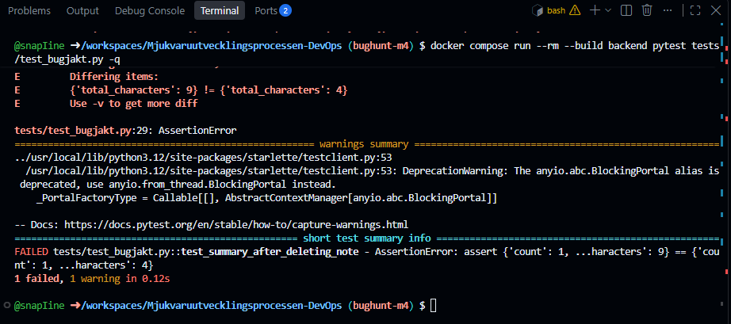

## 2. En förklaring:

Code review tittade bara på det nya funktionen och tester som kom, men missade att kolla vad som händer när just en anteckning skapas och sedan raderas.

Den gröna testviten testade att räkningen fungerade när vi lade till anteckningar, men de kollade inte vad som hände när vi tog bort en anteckning.

Pull requesten kunde mergas eftersom alla befintliga tester var gröna. Det saknades ett test som skulle ha kontrollerat just att "characters" antalet minskar när man raderar en anteckning.

## 3. Vår fix:

Vi fixade buggen genom att uppdatera _total_characters när en anteckning tas bort. Vi minskar räknaren med längden på den borttagna anteckningen och använder global _total_characters eftersom variabeln ligger utanför funktionen.

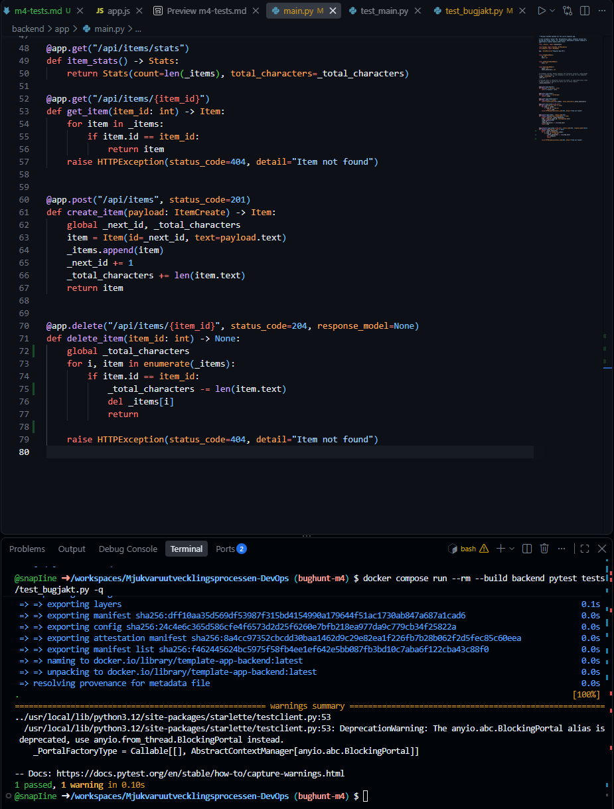

## 4. Hur kunde man ha undvikit hela buggen:

Det hade behövts ett test som skapade två anteckningar som tog bort en av dom och sedan kontrollerade vad slutliga summan av "characters" skulle ha blivit. Om det testet hade funnits från början hade buggen upptäckts innan Pull requesten blev merged.
###

# Vad vi gjorde utanför repot + skärmdumpar
### 1. Komma igång:
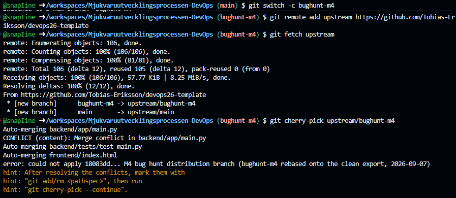
### 2. Cherry-pick:
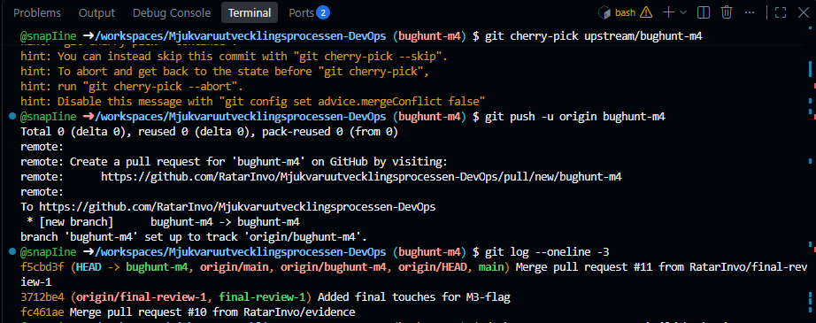
### 3. Testade git logs:
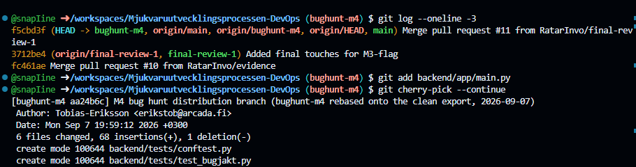
### 4. Acceptade båda git commits och pullade båda:
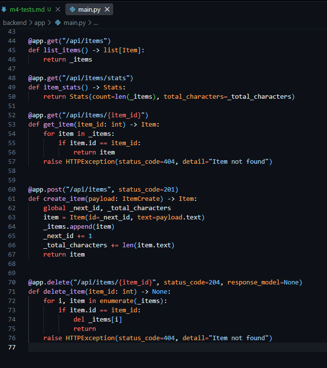
### 5. Bygger backend pytest:
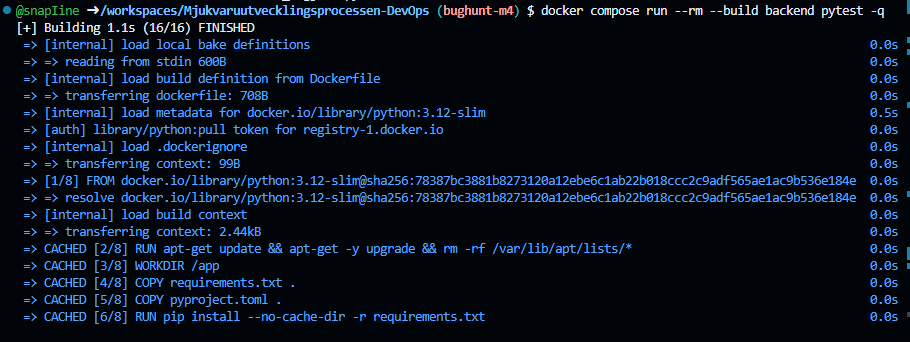
### 6. Proof att vi passade alla tests:
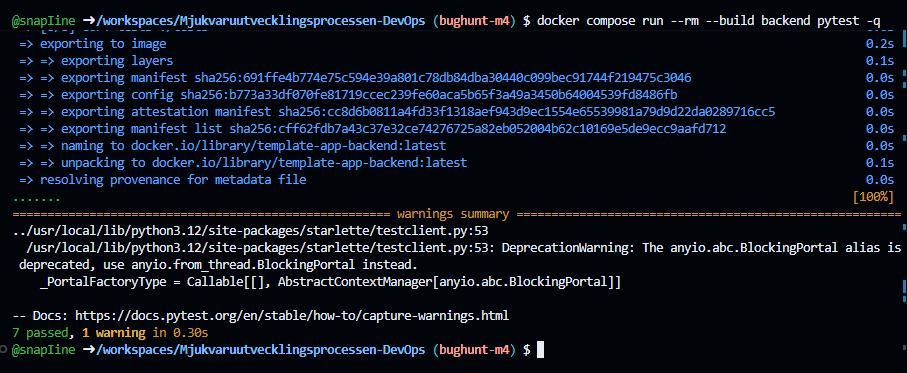
### 7. Vi bygger website hostingen:
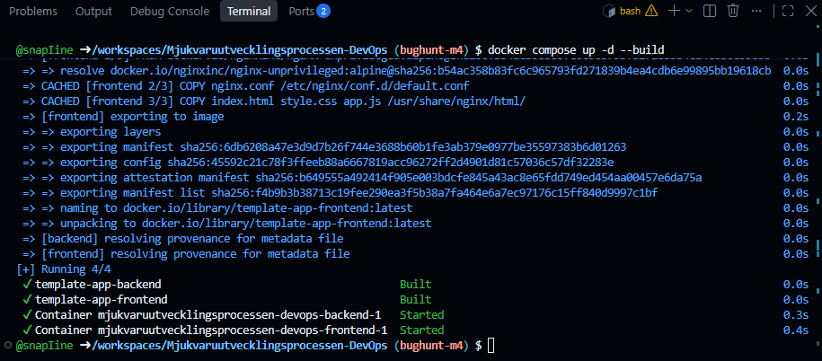
### 8. Sidan up & running:
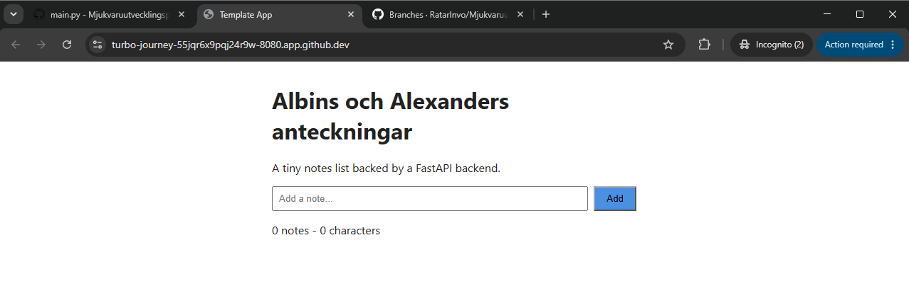
### 9. Bug testing nu:
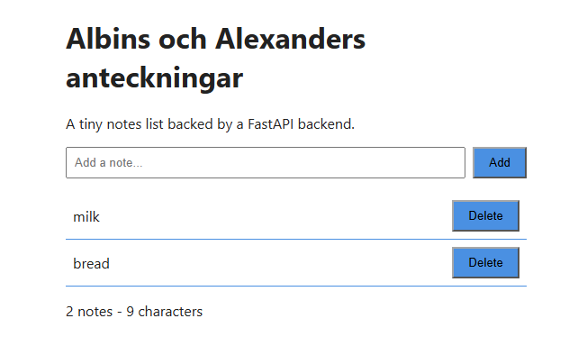
### 10. Bugged är att när man raderar notes så blir inte "characters" också deleted:
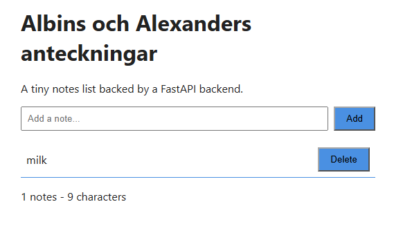
### 11. Efter att vi gjorde ett simpel test på test_bugjakt:

### 12. Fixade själva bugget:

### 13. Nu bygger vi hela backend pytest again:
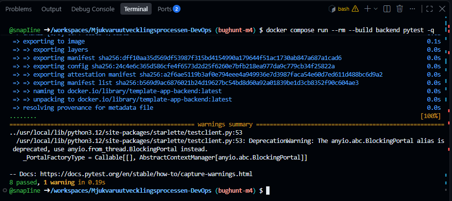
### 14. Nu kör vi upp hela webbsidan igen med docker:
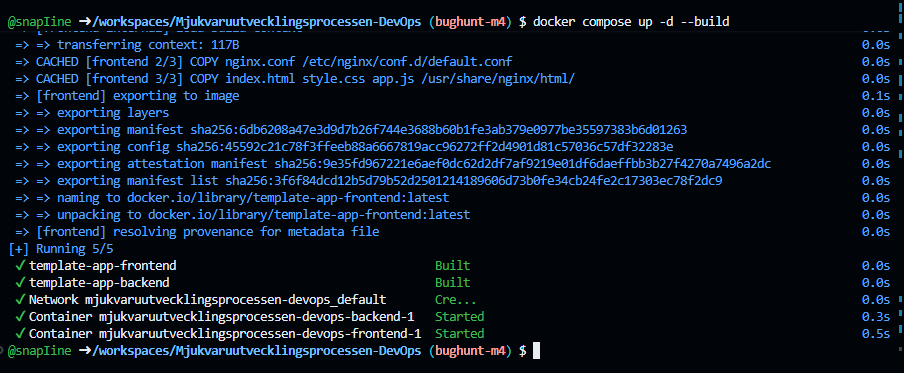
### 15. Testar samma bug igen part 1:
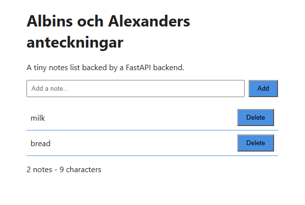
### 16. Testar samma bug igen part 2:
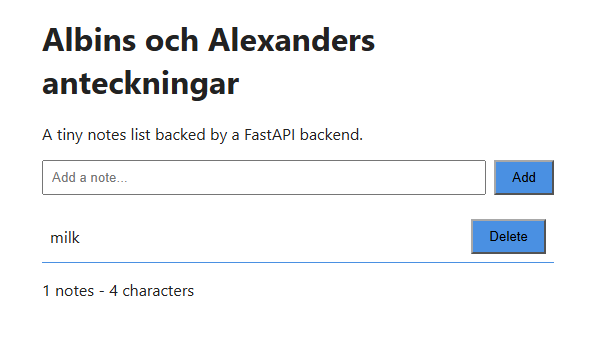
## Allt fungerar nu och vi lyckades fixa problemet!