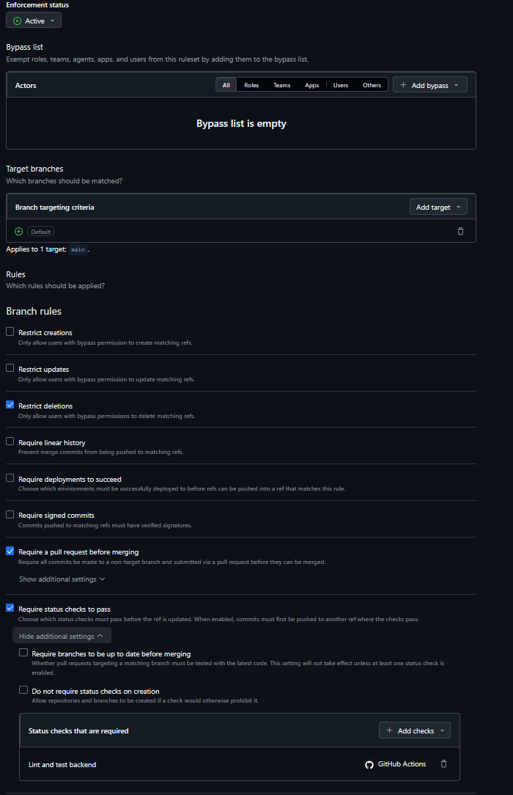
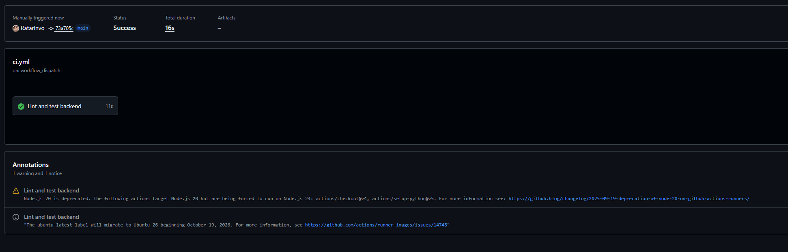

# M0 — Exempel: så här dokumenterar ni det osynliga arbetet

## Vad vi gjorde utanför repot

Vi ändrade i ruleset så att Lint och backend runnar efter varje push. Vi testade med att sätta en import som används inte som Ruff tog upp. 

## Skärmdump

### Lint and backend ruleset

### spärren fungerar: en medvetet röd PR

### manuell trigger för CI pipelines

