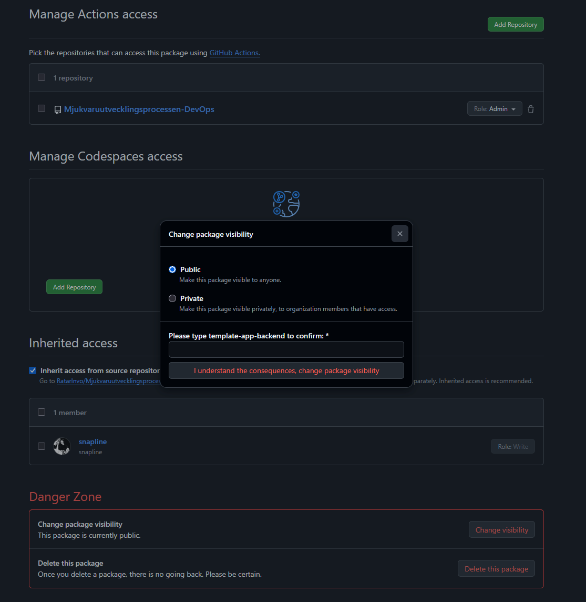
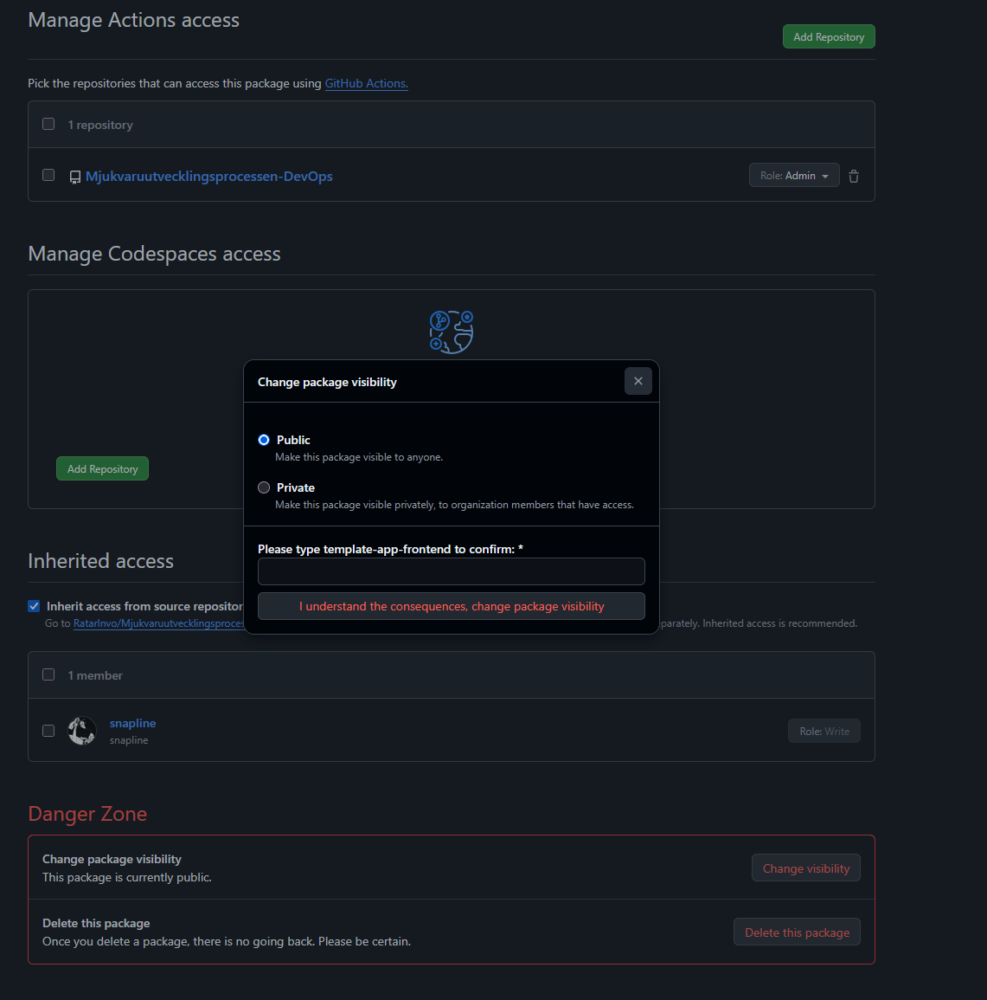

## Vad vi gjorde utanför repot
### Fråga: Hitta taggarna i docker/build-push-action@v5: en :latest och en :${{ github.sha }}. Vilken av de två skulle ni lita på om ni skulle återskapa exakt den image som kördes för tre veckor sedan?
### Svar: github.sha pekar mot en spcifik commit som byggde imagen då latest kommer ta nyaste som finns.
 
## Skärmdump

*Lägg bildfilen i samma mapp (`inlamning/`) och committa den tillsammans
med texten — `.gitignore` tillåter bilder.*

## Format

- 3–5 meningar: vad ni gjorde, var (vilket verktyg/konsol) och hur ni
  verifierade att det fungerade.
- Minst en skärmdump eller ett terminalutdrag när milstolpen har arbete
  utanför repot.
- Filnamn: `mN-<kort-namn>.<valfri ändelse>` (samma nummer som
  milstolpens tagg) — `.md` här är bara ett exempel, `.txt`, Word eller
  vad ni är bekväma med går lika bra.
