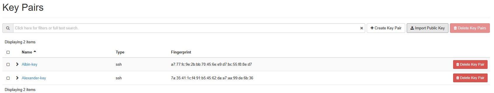
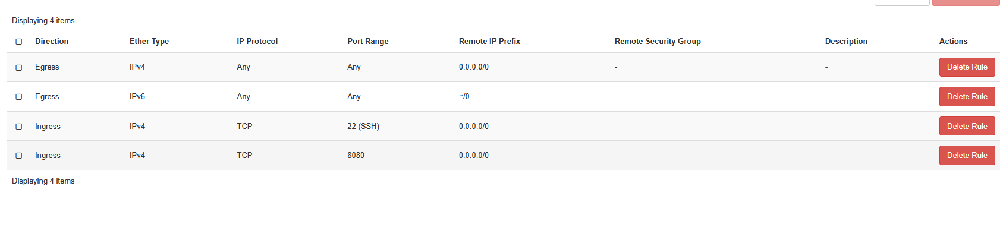
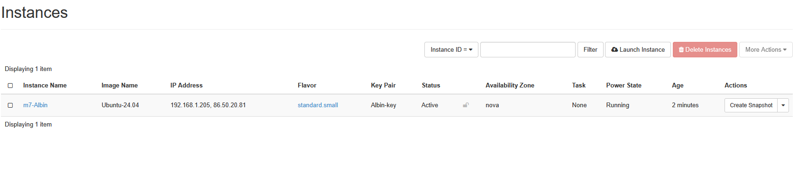
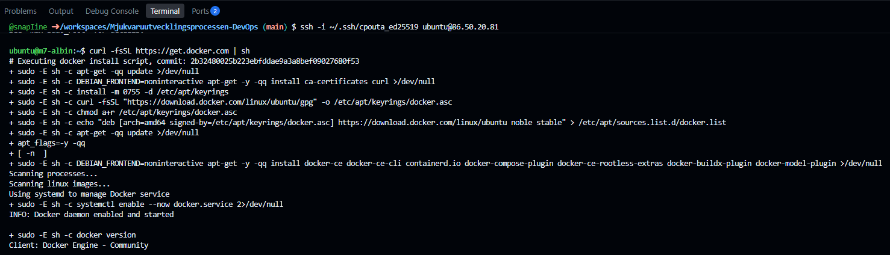
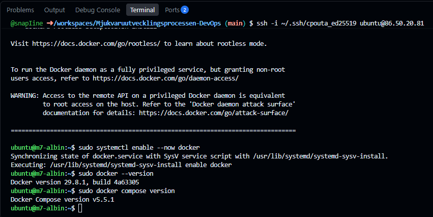
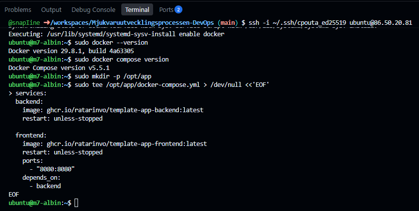
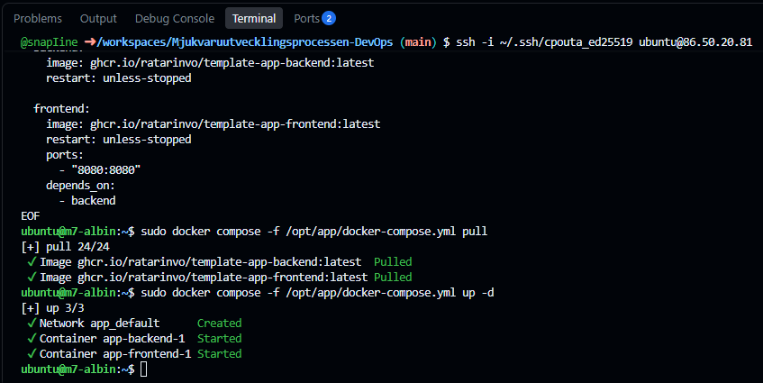
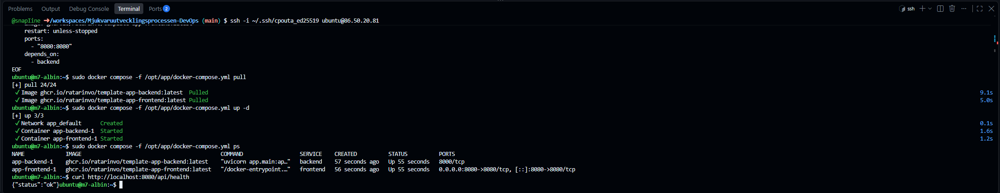
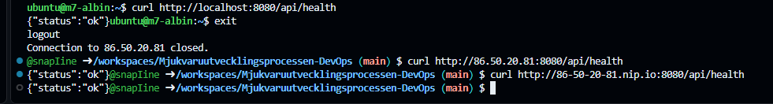
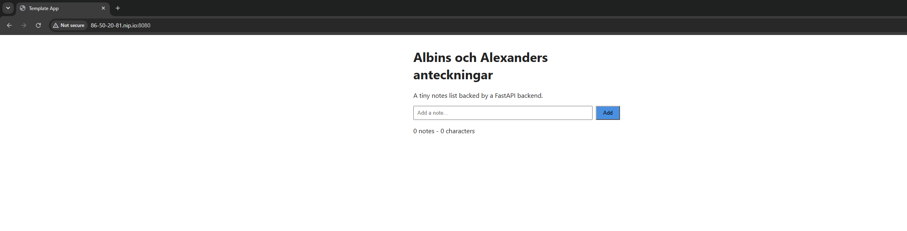

# M7 - Cloud VM

## Vad vi gjorde utanför repot
### I den här milstolpen byggde vi manuellt upp en Ubuntu 24.04 VM i CSC cPouta via Horizon-konsolen. Vi skapade egna SSH-nyckelpar och konfigurerade en security group som tillåter SSH på port 22 och applikationstrafik på port 8080.

### Vi startade VM:en med standard.small och kopplade en floating IP till den så att den kunde nås utifrån. Vi konfigurerade SSH så att båda i paret kunde logga in med sina egna nycklar.

### På VM:en installerade vi Docker och Docker Compose. Därefter skapade vi en docker-compose.yml som kör backend- och frontend-images från GHCR. Frontend-containern exponerades på port 8080.

### Vi verifierade först att applikationen fungerade från VM:en genom att anropa /api/health, vilket returnerade {"status":"ok"}. Därefter testade vi samma endpoint från vår codespace via floating IP:n för att bekräfta att applikationen var åtkomlig utifrån.

### Till sist använde vi en nip.io-adress för floating IP:n och öppnade den i webbläsaren. Notes-applikationen visades och allt funkade.

## Skärmdumpar

### Steg 2 – Publika nycklar uppladdade i cPouta

### Steg 3 – Security group med SSH och port 8080 öppna

### Steg 4–5 – VM:en kör med floating IP

### Steg 6 och 8 – SSH in och installera Docker

### Steg 8 – Docker och Docker Compose verifierade

### Steg 9 – docker-compose.yml skapad på VM:en

### Steg 9 – Images pullade och stacken startad

### Steg 10 – Verifiering på VM:en

### Steg 10 – Appen svarar utifrån via floating IP och nip.io

### Steg 10 – Notes-appen i webbläsaren

