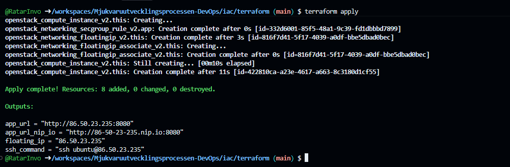
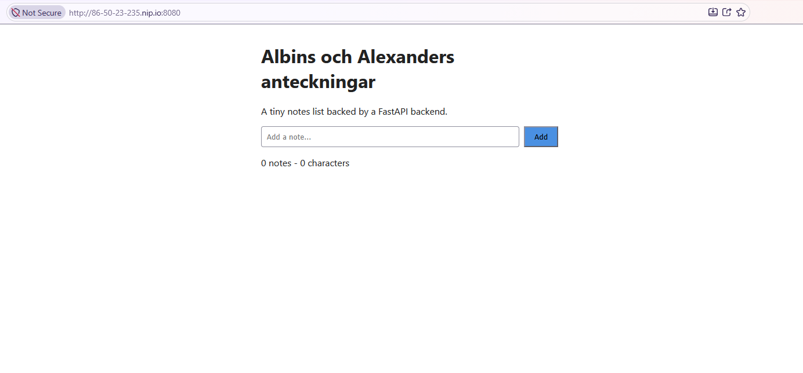
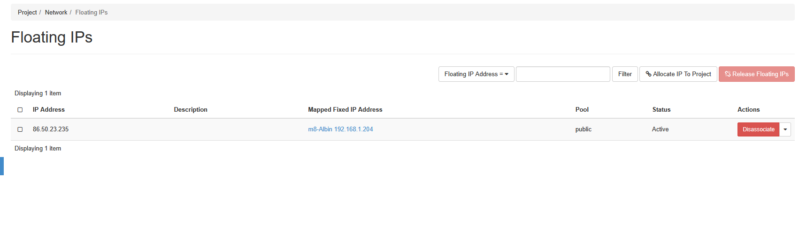
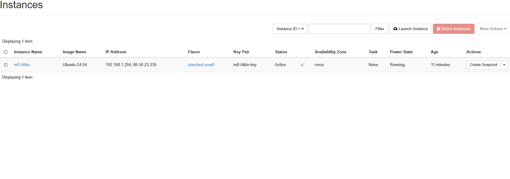
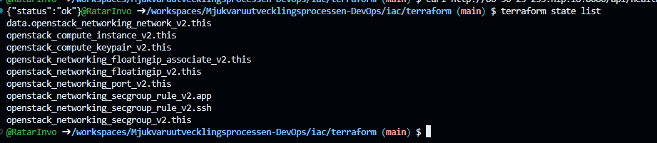
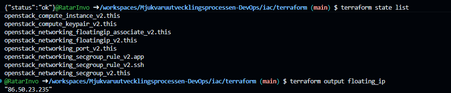
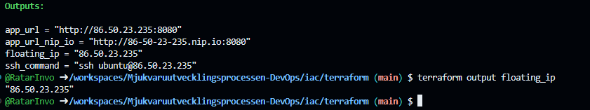

# M8 - iac

## Vad vi gjorde utanför repot
### Vi började med första att ge application credential till terrafrom via https://pouta.csc.fi. Vi satt namnet som devops-m8 och gav den user som role. Sedan laddade vi ner clouds.yaml filen och satt den under ~/.config/openstack/clouds.yaml. satt också miljövariabeln till namnet på nyckeln under clouds:. 

### I terraform.tfvars ändrade vi templaten variablerna till våra egna och sedan efter validera utan molnaccess.

### Vid steg 4 så började vi svetta. Här gjorde vi init, plan och sedan apply. Vi fick problem vid plan för att jag gjorde export OS_CLOUD=openstack i en annan codespace som sedan vi fixade med hjälpa av den smarta Tobias. 

### Vi testade också att floating ip addresen med curl och vi fick fina svar. 

### Vi rev ner gamla M7 som vi gjorde manuellt först genom pouta.csc och sedan lokalt med terrafrom destroy

## Skärmdumpar

### Steg 4 – [CLOUD] init, plan, apply mot cPouta

### Steg 5 – Verifiera utifrån

### Steg 6 – [KONSOL] Riv M7-VM:en och släpp dess floating IP

### Steg 6 – [KONSOL] Riv M7-VM:en och släpp dess floating IP

### Steg 7 – Läs state, rör den aldrig för hand

### Steg 8 – [CLOUD] Rebuild-demot: riv VM:en, behåll IP:n

### Steg 8 – [CLOUD] Rebuild-demot: riv VM:en, behåll IP:n

