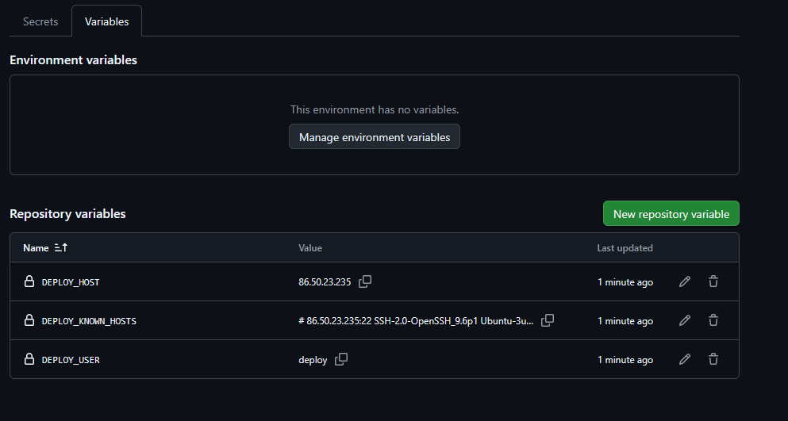
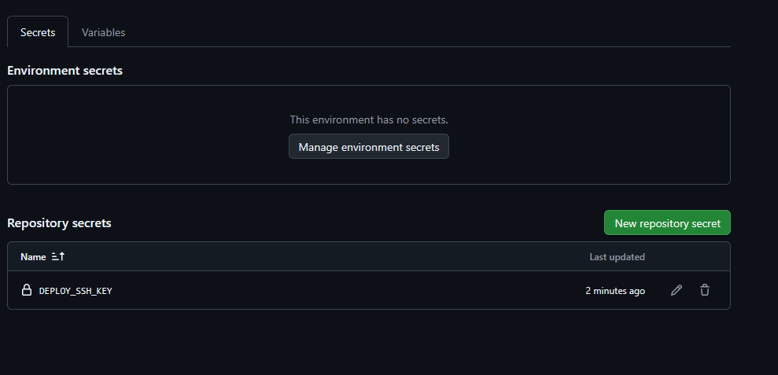
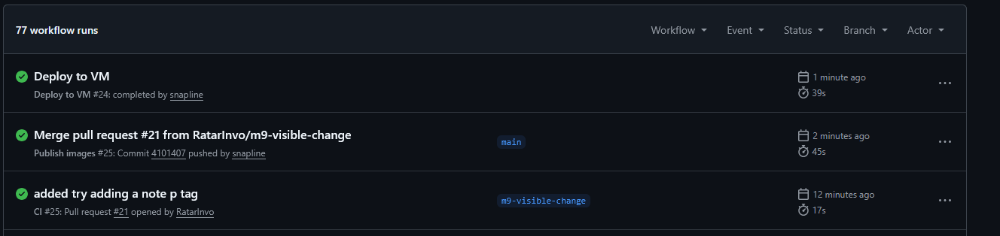
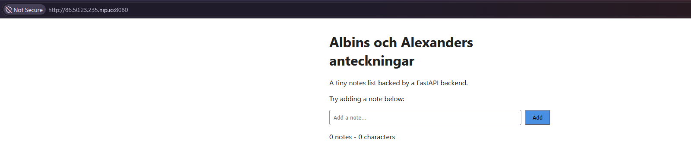

# M9 - cd

## Vad vi gjorde utanför repot
### Vi gjorde en ny ssh deploy nyckel och en depoly användare sedan lade vi till ssh-nyckel, adressen och host key på github.

### Nästa steg tittade vi att deploy.yaml fungerade med actionlint. Vi gjorde också en liten ändring i själv frontenden för att trigga en ny deploy av VM

### Lät Publish images bygga/pusha Docker-images till GHCR.

## Skärmdumpar

### Steg 3 – Deploy-användare på VM:en

### Steg 6 – GitHub Actions-variabler

### Steg 6 – GitHub Actions-secret

### Steg 9 – Actions-kedjan

### Steg 10 – Verifiering utifrån

